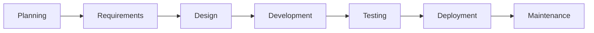

# How Spec Kit Develops Spec Kit: An Agentic SDLC

Spec Kit's own development combines agentic work with conventional software
delivery. Agents assess feature requests, help develop substantial changes,
and investigate reported bugs. The project also uses Spec Kit itself where
its processes fit, while deterministic tests and releases remain ordinary
GitHub Actions and maintainers make the decisions to proceed or merge.

Public workflows and a historical feature provide the evidence for this case
study. They show different paths through the project's SDLC, including where
the project uses Spec Kit itself.

## The project's software development life cycle

The traditional stages locate the project's practices across its SDLC.

These stages are a map, not a required sequence. Work can begin wherever
its starting material and goal call for it: a feature request in planning,
an existing change in testing, or a bug report in maintenance. Stages can
overlap, repeat, or be skipped; one feature issue can feed an assessment,
record requirements, and carry design discussion. The arrows show one
familiar path, not mandatory transitions between SDLC stages.
Feedback from maintenance can inform the next planning cycle.

## Who does the work

These modes illustrate how work gets done here; they are not an exhaustive
taxonomy or inventory of activities. A stage can combine them.

**Regular automation.** Scripts and bots follow predefined rules to run
checks, propose dependency updates, and publish releases. They do not
interpret feature requests or choose designs.

**Agent automation.** A coding agent interprets context and produces an
assessment, SDD artifacts, a proposed change, or a test report. It may run
through a contributor-invoked Spec Kit command, a contributor's own agent,
or a label-triggered repository workflow. Running an agent on GitHub
Actions does not make its reasoning a deterministic script.

A star (&#9733;) marks agentic work: before prose paragraphs and after
timeline items. A person (&#128100;) highlights human contributions in the
stage narratives, including work done with an agent's help.

**Human work.** People can frame issues, discuss approaches, write or revise
changes, and review evidence, with or without an agent's help. Maintainers
apply labels to start repository workflows and decide whether to proceed
or merge. Those handoffs are human decisions, not evidence that people
authored every assessment, specification, fix, or test report.

## How the project works at each stage

### 1. Planning: assess feature requests

A feature can enter planning through the
[feature request form](https://github.com/github/spec-kit/blob/main/.github/ISSUE_TEMPLATE/feature_request.yml).
It asks for the problem, proposed solution, alternatives, component, and use
cases. The resulting issue starts with `needs-triage`; filing it does not
automatically launch an agent.

&#9733; When a feature request is labeled for assessment, the
[feature-assess agentic workflow](https://github.com/github/spec-kit/blob/main/.github/workflows/feature-assess.md)
provisions the Specify CLI from the checkout, installs Spec Kit's bundled
[`assess` extension](assessment.md), and follows its intake, research, define,
shape, and decide stages. The agent posts its evidence and a `go`,
`needs-clarification`, or `kill` verdict to the issue. **This is an agentic
workflow using Spec Kit itself.**

&#128100; Contributors frame the request; maintainers decide whether to
initiate assessment and how to act on its verdict. A `go` finding informs
that planning decision; it does not automatically open a feature PR or
start SDD.

### 2. Requirements: record the intent in issues or specs

&#128100; Contributors can record early requirements in the same feature issue
through its problem statement, use cases, and acceptance criteria, then
clarify or revise the intent during discussion. For a bounded change, that
may be enough; it does not have to become an SDD `spec.md`.

&#9733; For substantial changes, contributors can instead expand the requirements
with Spec Kit's core SDD commands against the project's constitution. Spec Kit
used this process on itself in the
[historical bundler work](https://github.com/github/spec-kit/commit/3fd1e54d4b237af6124bb967e2eae24c93685a89):
the commit contains a constitution and feature specification for the
`specify bundle` command. This is evidence of **SDD dogfooding for that
feature**; the bundler work is distinct from the current `feature-assess`
workflow. The
[contribution guide](https://github.com/github/spec-kit/blob/main/CONTRIBUTING.md#does-spec-kit-use-spec-kit)
asks contributors to test relevant changes with SDD while allowing small fixes
to use the normal issue and PR process. Generated `specs/` artifacts are
normally gitignored; the linked commit preserves a historical snapshot.

### 3. Design: choose an approach at the right scale

&#128100; The feature form's proposed solution and alternatives can seed a
design discussion; contributors and maintainers can refine the approach
during PR review. A separate SDD plan is not required for every issue.
Larger changes need prior discussion and agreement with maintainers, as the
[contribution guide](https://github.com/github/spec-kit/blob/main/CONTRIBUTING.md#submitting-a-pull-request)
explains. When decisions should remain useful across changes, the repository
keeps [CLI](https://github.com/github/spec-kit/blob/main/design/cli.md),
[integration](https://github.com/github/spec-kit/blob/main/design/integration.md),
and [workflow-step](https://github.com/github/spec-kit/blob/main/design/workflow-step.md)
design documents.

&#9733; The [bundler SDD snapshot](https://github.com/github/spec-kit/commit/3fd1e54d4b237af6124bb967e2eae24c93685a89)
illustrates the deeper path: its plan, research, data model, contracts, and
tasks made the design actionable through `/speckit.plan` and
`/speckit.tasks`. This shows where Spec Kit itself was used without
presenting that level of detail as the default for every change.

### 4. Development: make reviewable changes

The [bundler implementation](https://github.com/github/spec-kit/pull/3070)
added `specify bundle` after the recorded SDD work. This is a concrete
specification-led feature in the project. Other bounded changes use the
ordinary issue, PR, review, and test process.

&#128100; Contributors can implement and revise changes directly or with an
agent's help. Maintainers review the resulting PR and its evidence, even
when an agent produced the proposed change.

&#9733; Contributors can use their own agents, independently of the repository's
workflows. Because that work may not be visible in a diff, the
[contribution policy](https://github.com/github/spec-kit/blob/main/CONTRIBUTING.md#ai-contributions-in-spec-kit)
requires disclosure of the tool, model, settings or mode, and extent of AI
assistance. Agent-authored commits and comments need their own attribution;
the known bug-fix and community-catalog workflows are exempt because their
agent identity is inherent. Disclosure provides provenance, not a lower
evidence or review bar.

### 5. Testing: verify both intent and behavior

&#9733; The bundler work includes a
[convergence pass](https://github.com/github/spec-kit/commit/de1c8ce6765f07cd1c4728a251b95adbfa3a8d07)
that appended a missing task. This is one example of Spec Kit's SDD process
checking implementation against intent rather than treating the first pass
as complete. The
[bug-test workflow](https://github.com/github/spec-kit/blob/main/.github/workflows/bug-test.md)
uses an agent to select relevant tests, but the test commands themselves
still run deterministically.

Separately, conventional GitHub Actions run
[Python tests and Ruff](https://github.com/github/spec-kit/blob/main/.github/workflows/test.yml),
[Markdown linting for documentation and ShellCheck for shell scripts](https://github.com/github/spec-kit/blob/main/.github/workflows/lint.yml),
and [CodeQL](https://github.com/github/spec-kit/blob/main/.github/workflows/codeql.yml)
on PRs and pushes to `main`. Agentic convergence complements those
independent checks.

&#128100; Contributors supply tests and reproduction evidence for changes;
maintainers assess whether the patch and evidence address the stated need,
not just whether the checks passed.

### 6. Deployment: publish without an agent

The Spec Kit repository uses regular GitHub Actions for delivery. The
[manually dispatched release trigger](https://github.com/github/spec-kit/blob/main/.github/workflows/release-trigger.yml)
sets the version, creates a tag, and opens a release PR. The tag triggers a
conventional
[GitHub Release](https://github.com/github/spec-kit/blob/main/.github/workflows/release.yml).
A separately dispatched workflow
[builds and publishes to PyPI](https://github.com/github/spec-kit/blob/main/.github/workflows/publish-pypi.yml);
a `docs/` change on `main` triggers
[DocFX deployment](https://github.com/github/spec-kit/blob/main/.github/workflows/docs.yml).
These conventional Actions handle deterministic delivery without an agent
or a Spec Kit command.

&#128100; Maintainers choose when to start a release and whether to specify
a version rather than use the automatic patch increment. They later dispatch
PyPI publishing for that tag and review the release PR.

### 7. Maintenance: investigate, repair, and learn

&#128100; Reporters supply observed and expected behavior and reproduction
steps through the
[bug report form](https://github.com/github/spec-kit/blob/main/.github/ISSUE_TEMPLATE/bug_report.yml).
Maintainers triage the report, choose when to request each agentic step,
and review the proposed fix and test evidence before merging. Reports can
arise before or after release; a newly discovered need can feed the next
planning cycle instead of being folded into a repair.

&#9733; The repository uses separate
[bug-assess](https://github.com/github/spec-kit/blob/main/.github/workflows/bug-assess.md),
[bug-fix](https://github.com/github/spec-kit/blob/main/.github/workflows/bug-fix.md),
and [bug-test](https://github.com/github/spec-kit/blob/main/.github/workflows/bug-test.md)
agentic workflows on issues. They separate diagnosis, remediation, and
verification with human-controlled handoffs; the fix is proposed as a draft
PR for maintainer review. **Today these project
workflows do not consume Spec Kit's bundled
[`bug` extension](bugfix.md)**, even though it offers a corresponding
assess, fix, test process for users. Having the workflows use that extension
is a direction for future work, not a current capability or a promised
release.

Agentic and conventional workflows both run on GitHub Actions. What changes
is whether an agent interprets evidence or proposes a change.
[Dependabot](https://github.com/github/spec-kit/blob/main/.github/dependabot.yml)
also proposes weekly pip and GitHub Actions dependency-update PRs for
maintainer review; it is conventional automation, not an agentic workflow.

## Extensibility and community practice

Extensibility cuts across this SDLC: the project builds and distributes
processes as well as using them. The team ships the
[`assess` bundle](https://github.com/github/spec-kit/tree/main/bundles/assess)
and [`bugfix` bundle](https://github.com/github/spec-kit/tree/main/bundles/bugfix),
each combining an extension with a resumable *Spec Kit workflow* and a human
review gate. It also ships the
[`lean` preset](https://github.com/github/spec-kit/tree/main/presets/lean)
to demonstrate an alternative way of shaping core SDD guidance. These are
Spec Kit's own [extensions, presets, workflows, and bundles](customization.md),
not the repository's GitHub Actions workflows.

&#9733; Beyond core feature delivery, agentic community-submission workflows for
[extensions](https://github.com/github/spec-kit/blob/main/.github/workflows/add-community-extension.md),
[presets](https://github.com/github/spec-kit/blob/main/.github/workflows/add-community-preset.md),
and [bundles](https://github.com/github/spec-kit/blob/main/.github/workflows/add-community-bundle.md)
validate submission metadata and propose catalog changes in draft PRs for
maintainer review.

Catalog discovery does not audit or endorse community code; users must
review third-party components before use.

## How we went from SDLC to an agentic SDLC

Agentic practices were layered into an existing SDLC, not substituted for
conventional checks and releases. The commit history shows how that mix
emerged over time. These are selected milestones, not an exhaustive
changelog. The same star marks agentic milestones, including use of Spec
Kit's SDD process; conventional automation and policies are unmarked.

| Month | What changed |
| --- | --- |
| August 2025 | <ul><li><a href="https://github.com/github/spec-kit/commit/28fdfaa8">GitHub Release automation</a> was added.</li></ul> |
| September 2025 | <ul><li><a href="https://github.com/github/spec-kit/commit/4b98c20f">Documentation deployment</a> was added.</li><li><a href="https://github.com/github/spec-kit/commit/6f3e450c">Contribution guidelines</a> began requiring disclosure of AI assistance, including contributor-run agents.</li></ul> |
| October 2025 | <ul><li><a href="https://github.com/github/spec-kit/commit/33a07969">Markdown linting</a> was added to PR and <code>main</code> checks.</li></ul> |
| February 2026 | <ul><li><a href="https://github.com/github/spec-kit/pull/1622">Dependabot</a> began proposing weekly pip and GitHub Actions dependency-update PRs.</li><li>A <a href="https://github.com/github/spec-kit/commit/9402ebd0">CodeQL workflow</a> was added for code scanning.</li><li><a href="https://github.com/github/spec-kit/pull/1637">Pytest CI</a> began running tests on PRs and pushes to <code>main</code>.</li><li><a href="https://github.com/github/spec-kit/pull/1637">Ruff linting</a> was added to the Python CI workflow.</li></ul> |
| May 2026 | <ul><li><a href="https://github.com/github/spec-kit/pull/2655">Extension submissions</a> gained catalog validation and draft PRs. &#9733;</li><li><a href="https://github.com/github/spec-kit/pull/2655">Preset submissions</a> gained catalog validation and draft PRs. &#9733;</li></ul> |
| June 2026 | <ul><li>An <a href="https://github.com/github/spec-kit/pull/3023">agentic bug-assess workflow</a> was added. &#9733;</li><li>The <a href="https://github.com/github/spec-kit/commit/3fd1e54d4b237af6124bb967e2eae24c93685a89">bundler feature</a> used Spec Kit's SDD process to produce its specification, plan, and tasks. &#9733;</li><li><a href="https://github.com/github/spec-kit/pull/2915">PyPI publishing</a> gained a conventional workflow.</li><li><a href="https://github.com/github/spec-kit/pull/3126">ShellCheck</a> began checking shell scripts in CI.</li></ul> |
| July 2026 | <ul><li><a href="https://github.com/github/spec-kit/pull/3258">Bug-fix</a> extended the agentic issue workflow with a human handoff. &#9733;</li><li><a href="https://github.com/github/spec-kit/pull/3257">Bug-test</a> added a separate verification stage. &#9733;</li><li><a href="https://github.com/github/spec-kit/pull/3553">Bundle submissions</a> gained catalog automation. &#9733;</li></ul> |
| August 2026 | <ul><li>The <a href="https://github.com/github/spec-kit/pull/4186">feature-assess workflow</a> began using Spec Kit's <code>assess</code> extension on feature requests. &#9733;</li></ul> |
| September 2026 | <ul><li><a href="https://github.com/github/spec-kit/pull/4512">AI disclosure</a> began requiring agent, model, settings, and extent.</li><li><a href="https://github.com/github/spec-kit/pull/4752">Contribution guidance</a> added attribution for agent-authored commits and comments.</li></ul> |

This was not a handoff from conventional automation to agents. Tests, lint,
scanning, and publishing kept repeatable work in GitHub Actions, while
disclosure made contributor-run agents visible. The project added agentic
catalog and bug workflows for bounded tasks, used SDD on a substantial
feature, and later made feature assessment consume Spec Kit's `assess`
extension. These were separate additions, not steps every issue must follow.

Together they give the project choices. For features, `assess` can inform a
human decision about a request; substantial implementation work can use SDD
to specify and plan it, as the bundler did. There is no automatic handoff
between those processes. A small change can stay in an issue and PR, while
a bug can move through human-gated assessment, repair, and verification.
Code changes still face conventional checks and maintainer review; issue
verdicts and catalog proposals have their own human gates.

## A production practice, not a prescribed recipe

For this public open-source project, a new issue is untrusted input, not
permission to run an agent. A maintainer activates each repository-owned
agentic workflow with its label and decides when work advances; contributors
can also bring their own agents, subject to disclosure and review. These are
deliberate boundaries for this project, not inherent limits of Spec Kit.

A closed project with a different trust model could automate more handoffs
between assessment, specification, implementation, and testing, while
keeping permissions, evidence, and review appropriate to the risk. Spec Kit's
production mix is not a prescribed recipe: teams can adopt agents in
different places, with or without Spec Kit's processes. That mix can change
with the project's needs and practices.

Here, agentic does not mean human-free: contributors still bring problems,
requirements, and changes; maintainers steer product direction, guide
delivery, and review evidence. Conventional automation handles repeatable
checks and publishing, while agents help with bounded work that requires
interpretation. This division aims to focus human time on judgment, though
the timeline shows adoption rather than measured time savings.
