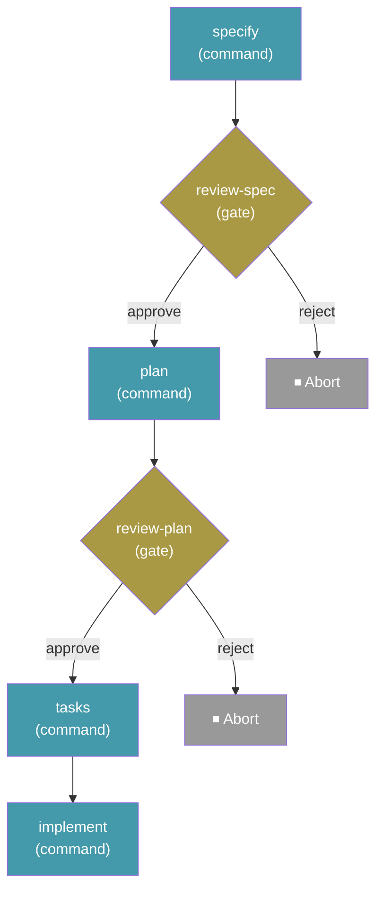

# Workflows

Workflows automate multi-step Spec-Driven Development processes — chaining commands, prompts, shell steps, and human checkpoints into repeatable sequences. They support conditional logic, loops, fan-out/fan-in, and can be paused and resumed from the exact point of interruption.

## Run a Workflow

```bash
specify workflow run <source>
```

| Option              | Description                                              |
| ------------------- | -------------------------------------------------------- |
| `-i` / `--input`    | Pass input values as `key=value` (repeatable)            |
| `--json`            | Emit the run outcome as a single JSON object             |

Runs a workflow from a catalog ID, URL, or local file path. Inputs declared by the workflow can be provided via `--input` or will be prompted interactively.

Example:

```bash
specify workflow run speckit -i spec="Build a kanban board with drag-and-drop task management" -i scope=full
```

With `--json`, a single machine-readable object is printed instead of formatted text (the default output is unchanged when the flag is omitted):

```bash
specify workflow run my-pipeline.yml --json
```

```json
{
  "run_id": "662bf791",
  "workflow_id": "build-and-review",
  "status": "paused",
  "current_step_id": "review",
  "current_step_index": 0
}
```

`workflow_id` is the `workflow.id` declared inside the YAML, not the file name. The object is printed exactly as shown — pretty-printed with two-space indentation, on plain stdout with no Rich markup — so it always parses. While the workflow runs under `--json`, any progress a step would print (for example a gate prompt, or output from a prompt step's CLI subprocess) is redirected to stderr, so stdout carries only the JSON object. Read the object from stdout; leave stderr attached to the terminal or capture it separately.

> **Note:** Most workflow commands require a project already initialized with `specify init`. The exception is `specify workflow run <local-file.{yml,yaml}>`, which can run outside a project; in that case, run state is stored under the current directory's `.specify/workflows/runs/<run_id>/`.

## Resume a Workflow

```bash
specify workflow resume <run_id>
```

| Option              | Description                                              |
| ------------------- | -------------------------------------------------------- |
| `-i` / `--input`    | Updated input values as `key=value` (repeatable)         |
| `--json`            | Emit the resume outcome as a single JSON object          |

Resumes a paused or failed workflow run from the exact step where it stopped. Useful after responding to a gate step or fixing an issue that caused a failure.

Supplied `--input` values are merged over the run's stored inputs and re-validated against the workflow's input types, then the blocked step is re-run with the updated values. This lets a run continue with information that only became available after it paused, or with a corrected value after a failure:

```bash
specify workflow resume <run_id> --input cmd="exit 0"
```

## Workflow Status

```bash
specify workflow status [<run_id>]
```

| Option              | Description                                              |
| ------------------- | -------------------------------------------------------- |
| `--json`            | Emit run status (or the runs list) as a JSON object      |

Shows the status of a specific run, or lists all runs if no ID is given. Run states: `created`, `running`, `completed`, `paused`, `failed`, `aborted`.

## List Installed Workflows

```bash
specify workflow list
```

Lists workflows installed in the current project.

## Install a Workflow

```bash
specify workflow add <source>
```

| Option          | Description                                            |
| --------------- | ------------------------------------------------------ |
| `--dev`         | Install from a local workflow YAML file or directory   |
| `--from <url>`  | Install from a custom URL (`<source>` names the expected workflow ID) |

Installs a workflow from the catalog, a URL (HTTPS required), or a local file path.

## Update Workflows

```bash
specify workflow update [workflow_id]
```

Updates one installed catalog workflow — or all of them when no ID is given — to the latest catalog version. Prompts for confirmation and keeps the installed copy if a download or validation fails.

## Enable or Disable a Workflow

```bash
specify workflow enable <workflow_id>
specify workflow disable <workflow_id>
```

Disabled workflows stay installed and listed (marked `[disabled]`) but refuse to run until re-enabled.

## Remove a Workflow

```bash
specify workflow remove <workflow_id>
```

Removes an installed workflow from the project.

## Search Available Workflows

```bash
specify workflow search [query]
```

| Option     | Description       |
| ---------- | ----------------- |
| `--tag`    | Filter by tag     |
| `--author` | Filter by author  |

Searches all active catalogs for workflows matching the query.

## Workflow Info

```bash
specify workflow info <workflow_id>
```

Shows detailed information about a workflow, including its steps, inputs, and requirements.

## Catalog Management

Workflow catalogs control where `search` and `add` look for workflows. Catalogs are checked in priority order.

### List Catalogs

```bash
specify workflow catalog list
```

Shows all active catalog sources.

### Add a Catalog

```bash
specify workflow catalog add <url>
```

| Option          | Description                      |
| --------------- | -------------------------------- |
| `--name <name>` | Optional name for the catalog    |

Adds a custom catalog URL to the project's `.specify/workflow-catalogs.yml`.

### Remove a Catalog

```bash
specify workflow catalog remove <index>
```

Removes a catalog by its index in the catalog list.

### Catalog Resolution Order

Catalogs are resolved in this order (first match wins):

1. **Environment variable** — `SPECKIT_WORKFLOW_CATALOG_URL` overrides all catalogs
2. **Project config** — `.specify/workflow-catalogs.yml`
3. **User config** — `~/.specify/workflow-catalogs.yml`
4. **Built-in defaults** — official catalog + community catalog

## Workflow Definition

Workflows are defined in YAML files. Here is the built-in **Full SDD Cycle** workflow that ships with Spec Kit:

```yaml
schema_version: "1.0"
workflow:
  id: "speckit"
  name: "Full SDD Cycle"
  version: "1.0.0"
  author: "GitHub"
  description: "Runs specify → plan → tasks → implement with review gates"

requires:
  speckit_version: ">=0.7.2"
  integrations:
    any: ["copilot", "claude", "gemini"]

inputs:
  spec:
    type: string
    required: true
    prompt: "Describe what you want to build"
  integration:
    type: string
    default: "copilot"
    prompt: "Integration to use (e.g. claude, copilot, gemini)"
  scope:
    type: string
    default: "full"
    enum: ["full", "backend-only", "frontend-only"]

steps:
  - id: specify
    command: speckit.specify
    integration: "{{ inputs.integration }}"
    input:
      args: "{{ inputs.spec }}"

  - id: review-spec
    type: gate
    message: "Review the generated spec before planning."
    options: [approve, reject]
    on_reject: abort

  - id: plan
    command: speckit.plan
    integration: "{{ inputs.integration }}"
    input:
      args: "{{ inputs.spec }}"

  - id: review-plan
    type: gate
    message: "Review the plan before generating tasks."
    options: [approve, reject]
    on_reject: abort

  - id: tasks
    command: speckit.tasks
    integration: "{{ inputs.integration }}"
    input:
      args: "{{ inputs.spec }}"

  - id: implement
    command: speckit.implement
    integration: "{{ inputs.integration }}"
    input:
      args: "{{ inputs.spec }}"
```

This produces the following execution flow:



Run it with:

```bash
specify workflow run speckit -i spec="Build a kanban board with drag-and-drop task management"
```

## Step Types

| Type         | Purpose                                          |
| ------------ | ------------------------------------------------ |
| `command`    | Invoke a Spec Kit command (e.g., `speckit.plan`) |
| `prompt`     | Send an arbitrary prompt to the AI coding agent  |
| `shell`      | Execute a shell command and capture output       |
| `init`       | Bootstrap a project (like `specify init`)        |
| `gate`       | Pause for human approval before continuing       |
| `if`         | Conditional branching (then/else)                |
| `switch`     | Multi-branch dispatch on an expression           |
| `while`      | Loop while a condition is true                   |
| `do-while`   | Execute at least once, then loop on condition    |
| `fan-out`    | Dispatch a step for each item in a list          |
| `fan-in`     | Aggregate results from a fan-out step            |

> **Security note:** a `shell` step runs a local command with **your** privileges. There is no capability sandbox — `requires` is an advisory pre-condition block (spec-kit version, integrations), not a runtime gate, so it does **not** restrict what a step can do. In particular there is no `requires.permissions` capability gate: it is rejected by validation precisely because it would imply a sandbox that does not exist. Review any catalog or downloaded workflow before running it, and use a `gate` step to require explicit approval before sensitive or destructive shell commands.

## Expressions

Steps can reference inputs and previous step outputs using `{{ expression }}` syntax:

| Namespace                      | Description                          |
| ------------------------------ | ------------------------------------ |
| `inputs.spec`                  | Workflow input values                |
| `steps.specify.output.file`    | Output from a previous step          |
| `item`                         | Current item in a fan-out iteration  |

Available filters: `default`, `join`, `contains`, `map`, `from_json`.

Example:

```yaml
condition: "{{ steps.test.output.exit_code == 0 }}"
args: "{{ inputs.spec }}"
message: "{{ status | default('pending') }}"
```

## Input Types

| Type      | Coercion                                          |
| --------- | ------------------------------------------------- |
| `string`  | Pass-through                                      |
| `number`  | `"42"` → `42`, `"3.14"` → `3.14`                 |
| `boolean` | `"true"` / `"1"` / `"yes"` → `True`              |

## State and Resume

Each workflow run persists its state at `.specify/workflows/runs/<run_id>/`:

- `state.json` — current run state and step progress
- `inputs.json` — resolved input values
- `log.jsonl` — step-by-step execution log

This enables `specify workflow resume` to continue from the exact step where a run was paused (e.g., at a gate) or failed.

## FAQ

### What happens when a workflow hits a gate step?

The workflow pauses and waits for human input. Run `specify workflow resume <run_id>` after reviewing to continue.

### Can I run the same workflow multiple times?

Yes. Each run gets a unique ID and its own state directory. Use `specify workflow status` to see all runs.

### Who maintains workflows?

Most workflows are independently created and maintained by their respective authors. The Spec Kit maintainers do not review, audit, endorse, or support workflow code. Review a workflow's source before installing and use at your own discretion.
