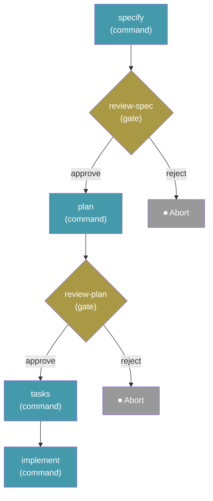

# Workflows

Workflows automate multi-step Spec-Driven Development processes — chaining commands, prompts, shell steps, and human checkpoints into repeatable sequences. They support conditional logic, loops, fan-out/fan-in, and can be paused and resumed from the exact point of interruption.

## Run a Workflow

```bash
specify workflow run <source>
```

| Option              | Description                                              |
| ------------------- | -------------------------------------------------------- |
| `-i` / `--input`    | Pass input values as `key=value` (repeatable)            |
| `--json`            | Emit the run outcome as a single JSON object             |

Runs a workflow from a catalog ID, URL, or local file path. Inputs declared by the workflow can be provided via `--input` or will be prompted interactively.

Example:

```bash
specify workflow run speckit -i spec="Build a kanban board with drag-and-drop task management"
```

With `--json`, a single machine-readable object is printed instead of formatted text (the default output is unchanged when the flag is omitted):

```bash
specify workflow run my-pipeline.yml --json
```

```json
{
  "run_id": "662bf791",
  "workflow_id": "build-and-review",
  "status": "paused",
  "current_step_id": "review",
  "current_step_index": 0
}
```

`workflow_id` is the `workflow.id` declared inside the YAML, not the file name. The object is printed exactly as shown — pretty-printed with two-space indentation, on plain stdout with no Rich markup — so it always parses. While the workflow runs under `--json`, any progress a step would print (for example a gate prompt, or output from a prompt step's CLI subprocess) is redirected to stderr, so stdout carries only the JSON object. Read the object from stdout; leave stderr attached to the terminal or capture it separately.

For `failed` and `aborted` runs, the payload includes an `error` field carrying the terminal step's error message:

```json
{
  "run_id": "662bf791",
  "workflow_id": "build-and-review",
  "status": "failed",
  "current_step_id": "boom",
  "current_step_index": 0,
  "error": "Command exited with code 3"
}
```

`completed` and `paused` runs omit the `error` field. The error is persisted in the run's `state.json`, so `specify workflow status <run_id> --json` surfaces the same message after the fact.

> **Note:** Most workflow commands require a project already initialized with `specify init`. The exception is `specify workflow run <local-file.{yml,yaml}>`, which can run outside a project; in that case, run state is stored under the current directory's `.specify/workflows/runs/<run_id>/`.

## Resume a Workflow

```bash
specify workflow resume <run_id>
```

| Option              | Description                                              |
| ------------------- | -------------------------------------------------------- |
| `-i` / `--input`    | Updated input values as `key=value` (repeatable)         |
| `--json`            | Emit the resume outcome as a single JSON object          |

Resumes a paused or failed workflow run from the exact step where it stopped. Useful after responding to a gate step or fixing an issue that caused a failure.

Supplied `--input` values are merged over the run's stored inputs and re-validated against the workflow's input types, then the blocked step is re-run with the updated values. This lets a run continue with information that only became available after it paused, or with a corrected value after a failure:

```bash
specify workflow resume <run_id> --input cmd="exit 0"
```

## Workflow Status

```bash
specify workflow status [<run_id>]
```

| Option              | Description                                              |
| ------------------- | -------------------------------------------------------- |
| `--json`            | Emit run status (or the runs list) as a JSON object      |

Shows the status of a specific run, or lists all runs if no ID is given. Run states: `created`, `running`, `completed`, `paused`, `failed`, `aborted`.

## List Installed Workflows

```bash
specify workflow list
```

Lists workflows installed in the current project.

## Install a Workflow

```bash
specify workflow add <source>
```

| Option          | Description                                            |
| --------------- | ------------------------------------------------------ |
| `--dev`         | Install from a local YAML file, package directory, or archive |
| `--from <url>`  | Install from a custom URL (`<source>` names the expected workflow ID) |
| `--version <version>` | Install an exact advertised catalog release (`<source>` must be a workflow ID) |

Installs a workflow from the catalog, an HTTPS URL, a local YAML file, a
directory containing `workflow.yml`, or a `.zip`, `.tar.gz`, or `.tgz`
archive. Archives may contain `workflow.yml` at the root or inside one
top-level directory.

Directory and archive installs preserve the complete workflow package,
including scripts and other companion files. ZIP, `.tar.gz`, and `.tgz`
archives follow the same validation and installation behavior.

Catalog entries keep the current release's `version`, `url`, optional `sha256`,
and optional `requires` at the top level. An optional `releases` mapping
advertises historical versions without changing what unqualified `add`,
`search`, `info`, or `update` select:

```json
{
  "id": "example",
  "version": "2.0.0",
  "url": "https://example.com/example-2.0.0.zip",
  "releases": {
    "1.0.0": {
      "url": "https://example.com/example-1.0.0.zip",
      "sha256": "aaaaaaaaaaaaaaaaaaaaaaaaaaaaaaaaaaaaaaaaaaaaaaaaaaaaaaaaaaaaaaaa",
      "requires": {"speckit_version": ">=1.0.0"}
    }
  }
}
```

Each historical release needs its own URL and SHA-256 digest; `requires` is
optional and, when present, must match the downloaded workflow definition.
Advertised versions use the workflow definition's `X.Y.Z` version format;
`--version` also accepts equivalent spellings such as `v1.0` when selecting an
advertised `1.0.0` release.
The requested version must exist in the highest-priority catalog that provides
the workflow. A missing version does not fall back to another source, and
discovery-only catalogs cannot be installed from. The downloaded workflow ID,
version, and declared digest are verified before installation. `--version` does
not apply to local paths, direct URLs, or `--from` installations.

## Workflow Overlays

Workflow overlays let a project extend or override an installed workflow without editing the installed `workflow.yml`.  This keeps local customizations safe across `specify bundle update` or `specify workflow add` upgrades.

When `specify workflow run <workflow-id>` loads a workflow, the engine composes the base workflow with all enabled overlays for that workflow id.  The result is validated like any other workflow definition.

### How Overlays Work

An overlay is a YAML file that declares a set of edit operations against the step list of a base workflow. Overlays use lower-wins precedence: higher priority numbers are applied first and lower numbers last. Equal-priority overlays are applied alphabetically by ID, with the last ID winning conflicts.

Project overlay files live at:

| Location | Purpose |
| --- | --- |
| `.specify/workflows/overlays/<id>/*.yml` | Project-local customizations |

### Overlay File Format

The recommended edit format uses the operation name as the key and the anchor step id as the value:

```yaml
id: "my-overlay"
extends: "speckit"
priority: 10
enabled: true
edits:
  - insert_after: implement
    step:
      id: run-lint
      type: shell
      run: "ruff check src/"

  - replace: review-spec
    step:
      id: review-spec
      type: gate
      message: "Review the generated spec (overlay override)."
      options: [approve, reject]
      on_reject: abort
```

The explicit form is also supported:

```yaml
edits:
  - operation: insert_after
    anchor: implement
    step:
      id: run-lint
      type: shell
      run: "ruff check src/"
```

#### Fields

| Field | Required | Description |
| --- | --- | --- |
| `id` | yes | Identifier for this overlay. Used in `specify workflow overlay *` commands. Must be lowercase letters, digits, and hyphens only; no dots, underscores, path separators, or `overlays`. |
| `extends` | yes | The workflow id this overlay applies to. Uses the same safe-id format as `id`; `overlays`, `runs`, and `steps` are reserved. |
| `priority` | no | Integer; defaults to `10`. Lower values have higher precedence and win conflicts. Missing or invalid values fall back to `10`. |
| `enabled` | no | Boolean. Defaults to `true`. Disabled overlays are ignored. |
| `edits` | yes | Non-empty list of edit operations. |

#### Edit Operations

| Operation | `step` required | Effect |
| --- | --- | --- |
| `insert_after` | yes | Insert `step` immediately after the anchor step. |
| `insert_before` | yes | Insert `step` immediately before the anchor step. |
| `replace` | yes | Replace the anchor step with `step`. |
| `remove` | no | Remove the anchor step from the list. |

The `anchor` is the `id` of a step in the base workflow.  Anchors are resolved recursively inside `then`, `else`, `steps`, `cases.*`, and `default` blocks, so nested base steps can also be targeted.  Fan-out templates (`step` inside a `fan-out` step) are **not** valid anchors.

Step ids must not contain `:` — that character is reserved for engine-generated nested ids.

### Overlay CLI Commands

#### Add a Project Overlay

```bash
specify workflow overlay add <path-to-overlay.yml> --priority <n>
```

Validates the overlay file and copies it to `.specify/workflows/overlays/<extends>/<id>.yml`. `--priority` defaults to `10` and overrides the `priority` field in the file.

#### List Overlays

```bash
specify workflow overlay list <workflow-id>
```

Shows all overlays for the workflow, ordered by resolver precedence. Disabled overlays are marked as disabled in the listing and are ignored during workflow resolution.

#### Change Priority

```bash
specify workflow overlay set-priority <workflow-id> <overlay-id> <n>
```

#### Enable or Disable

```bash
specify workflow overlay disable <workflow-id> <overlay-id>
specify workflow overlay enable <workflow-id> <overlay-id>
```

#### Remove

```bash
specify workflow overlay remove <workflow-id> <overlay-id>
```

Removes the project overlay file.

#### Inspect the Composed Workflow

```bash
specify workflow resolve <workflow-id>
```

Prints the layer stack (base + overlays) and the source attribution for each step after composition.  Useful for debugging which overlay contributed or overrode a step.

### Example: Adding Automated Linting after Implementation

Given the built-in `speckit` workflow, create `project-overlay.yml`:

```yaml
id: "add-lint"
extends: "speckit"
priority: 10
edits:
  - insert_after: implement
    step:
      id: run-lint
      type: shell
      run: "ruff check src/"
```

Install it:

```bash
specify workflow overlay add project-overlay.yml --priority 10
```

Run the workflow:

```bash
specify workflow run speckit -i spec="Build a kanban board"
```

The composed workflow will now run the full SDD cycle and execute `ruff check src/` automatically after the `implement` step.

### Example: Replacing a Gate

```yaml
id: "skip-plan-review"
extends: "speckit"
priority: 5
edits:
  - replace: review-plan
    step:
      id: review-plan
      type: command
      command: speckit.plan
      input:
        args: "{{ inputs.spec }}"
```

Lower priority values have higher precedence. Change this overlay to `priority: 5` if it must win a conflict with the `add-lint` overlay above. It replaces the `review-plan` gate with a non-interactive command.

### Workflow slots (upstream extension points)

Workflow authors can declare a named, no-op workflow slot with `type: slot`:

```yaml
- id: post-implement
  type: slot
  name: "Post-implementation checks"
```

The step `id` is the unique overlay anchor; `name` is a required non-blank,
human-readable label only. An unfilled slot completes as a `skipped` step with
`output: {slot: <name>}`, so subsequent steps continue normally.

Fill a slot with a schema-valid overlay `replace` edit anchored on the step
`id`, not its `name`:

```yaml
id: fill-post-implement
extends: my-workflow
edits:
  - replace: post-implement
    step:
      id: post-implement
      type: shell
      run: "echo Run project-specific checks"
```

Reuse the slot's `id` when later expressions or `fan-in.wait_for` refer to it.
The replacement must also preserve every output key those later steps consume:
an unfilled workflow slot supplies only `steps.<id>.output.slot`. Slot steps are
not supported inside `fan-out.step` templates because runtime-multiplied
templates cannot be overlay anchors.

### Interaction with Bundles and Updates

`specify workflow add <local-directory>` installs the complete local workflow
package into `.specify/workflows/<id>/`. Archive installs preserve the same
package contents.

When an installed workflow is refreshed or reinstalled, project overlays in `.specify/workflows/overlays/<id>/` are preserved because they live outside the installed workflow directory.

### Limitations

- Overlays operate on the step list only.  They cannot change workflow metadata (name, description, inputs, `requires`) or expression logic.
- Fan-out templates cannot be used as anchors.
- An overlay that targets a step id that does not exist in the base workflow will raise a validation error when the workflow is resolved.
- Overlays cannot target steps added by other overlays.
- Overlays cannot add new inputs or change the input schema of the base workflow.

## Update Workflows

```bash
specify workflow update [workflow_id]
```

Updates one installed catalog workflow — or all of them when no ID is given — to the latest catalog version. Prompts for confirmation and keeps the installed copy if a download or validation fails.

## Enable or Disable a Workflow

```bash
specify workflow enable <workflow_id>
specify workflow disable <workflow_id>
```

Disabled workflows stay installed and listed (marked `[disabled]`) but refuse to run until re-enabled.

## Remove a Workflow

```bash
specify workflow remove <workflow_id>
```

Removes an installed workflow from the project.

## Search Available Workflows

```bash
specify workflow search [query]
```

| Option     | Description       |
| ---------- | ----------------- |
| `--tag`    | Filter by tag     |
| `--author` | Filter by author  |

Searches all active catalogs for workflows matching the query.

## Workflow Info

```bash
specify workflow info <workflow_id>
specify workflow info <workflow_id> --versions
```

Shows detailed information about a workflow, including its steps, inputs, and requirements.
`--versions` lists the current catalog version followed by advertised historical
versions and indicates whether the winning catalog is installable or
discovery-only (not installable). It also works when a different version is
installed locally.

## Catalog Management

Workflow catalogs control where `search` and `add` look for workflows. Catalogs are checked in priority order.

> **A project's `.specify/workflow-catalogs.yml` can point `add` and `search` at a catalog you didn't choose.** Before running a workflow from an unfamiliar project, run `specify workflow catalog list` (and `specify workflow step catalog list` for the step catalogs its steps can pull in) — a project supplying that config is not evidence its workflows or steps were vetted. Maintainers do not audit `run` fields; read a workflow's shell steps yourself before running it (see [Who maintains workflows?](#who-maintains-workflows)).

### List Catalogs

```bash
specify workflow catalog list
```

Shows all active catalog sources.

### Add a Catalog

```bash
specify workflow catalog add <url>
```

| Option          | Description                      |
| --------------- | -------------------------------- |
| `--name <name>` | Optional name for the catalog    |

Adds a custom catalog URL to the project's `.specify/workflow-catalogs.yml`.

Re-adding the same workflow or step catalog URL with the same name succeeds without changing the configuration; a different name is rejected.

### Remove a Catalog

```bash
specify workflow catalog remove <index>
specify workflow step catalog remove <index>
```

Removes a project catalog by its index in the corresponding priority-ordered `catalog list`.
Sources supplied by `SPECKIT_WORKFLOW_CATALOG_URL` or `SPECKIT_STEP_CATALOG_URL` cannot be removed this way; unset the variable to manage project sources.

### Catalog Resolution Order

Catalogs are resolved in this order (first match wins):

1. **Environment variable** — `SPECKIT_WORKFLOW_CATALOG_URL` overrides all catalogs
2. **Project config** — `.specify/workflow-catalogs.yml`
3. **User config** — `~/.specify/workflow-catalogs.yml`
4. **Built-in defaults** — official catalog + community catalog

## Workflow Definition

Workflows are defined in YAML files. Here is the built-in **Full SDD Cycle** workflow that ships with Spec Kit:

```yaml
schema_version: "1.0"
workflow:
  id: "speckit"
  name: "Full SDD Cycle"
  version: "1.0.1"
  author: "GitHub"
  description: "Runs specify → plan → tasks → implement with review gates"

requires:
  speckit_version: ">=0.8.5"
  integrations:
    any:
      - "alquimia"
      - "claude"
      - "copilot"
      - "gemini"
      - "opencode"

inputs:
  spec:
    type: string
    required: true
    prompt: "Describe what you want to build"
  integration:
    type: string
    default: "auto"
    prompt: "Integration to use (e.g. claude, copilot, gemini; 'auto' uses the project's initialized integration)"

steps:
  - id: specify
    command: speckit.specify
    integration: "{{ inputs.integration }}"
    input:
      args: "{{ inputs.spec }}"

  - id: review-spec
    type: gate
    message: "Review the generated spec before planning."
    options: [approve, reject]
    on_reject: abort

  - id: plan
    command: speckit.plan
    integration: "{{ inputs.integration }}"
    input:
      args: "{{ inputs.spec }}"

  - id: review-plan
    type: gate
    message: "Review the plan before generating tasks."
    options: [approve, reject]
    on_reject: abort

  - id: tasks
    command: speckit.tasks
    integration: "{{ inputs.integration }}"
    input:
      args: "{{ inputs.spec }}"

  - id: implement
    command: speckit.implement
    integration: "{{ inputs.integration }}"
    input:
      args: "{{ inputs.spec }}"
```

This produces the following execution flow:


```mermaid
flowchart TB
    A["specify<br/>(command)"] --> B{"review-spec<br/>(gate)"}
    B -- approve --> C["plan<br/>(command)"]
    B -- reject --> X1["⏹ Abort"]
    C --> D{"review-plan<br/>(gate)"}
    D -- approve --> E["tasks<br/>(command)"]
    D -- reject --> X2["⏹ Abort"]
    E --> F["implement<br/>(command)"]

    style A fill:#49a,color:#fff
    style B fill:#a94,color:#fff
    style C fill:#49a,color:#fff
    style D fill:#a94,color:#fff
    style E fill:#49a,color:#fff
    style F fill:#49a,color:#fff
    style X1 fill:#999,color:#fff
    style X2 fill:#999,color:#fff
```

Run it with:

```bash
specify workflow run speckit -i spec="Build a kanban board with drag-and-drop task management"
```

## Step Types

| Type         | Purpose                                          |
| ------------ | ------------------------------------------------ |
| `command`    | Invoke a Spec Kit command (e.g., `speckit.plan`) |
| `prompt`     | Send an arbitrary prompt to the AI coding agent  |
| `shell`      | Execute a shell command and capture output       |
| `init`       | Bootstrap a project (like `specify init`)        |
| `slot`       | Named workflow slot; skipped when unfilled       |
| `gate`       | Pause for human approval before continuing       |
| `if`         | Conditional branching (then/else)                |
| `switch`     | Multi-branch dispatch on an expression           |
| `while`      | Loop while a condition is true                   |
| `do-while`   | Execute at least once, then loop on condition    |
| `fan-out`    | Dispatch a step for each item in a list          |
| `fan-in`     | Aggregate results from a fan-out step            |

> **Security note:** a `shell` step runs a local command with **your** privileges. There is no capability sandbox — `requires` is an advisory pre-condition block (spec-kit version, integrations), not a runtime gate, so it does **not** restrict what a step can do. In particular there is no `requires.permissions` capability gate: it is rejected by validation precisely because it would imply a sandbox that does not exist. Review any catalog or downloaded workflow before running it, and use a `gate` step to require explicit approval before sensitive or destructive shell commands.

### Custom step packages

Custom step types are installed with `specify workflow step`. A step is a
directory package containing metadata and executable Python:

```text
my-step/
├── step.yml        # required, at the package root
├── __init__.py     # required, at the package root
└── helpers.py      # optional nested modules and data files
```

To prepare a public package for community catalog intake, see
[Community Workflow Step Types](../community/workflow-steps.md).

`step.yml` declares the step's identity. `step.type_key` must exactly match the
`<step_id>` passed on the command line — the ID is never inferred from package
content:

```yaml
step:
  type_key: my-step
  name: My Step
  version: 0.1.0
  author: you
  description: What this step does
```

`__init__.py` must define a `StepBase` subclass whose `type_key` matches:

```python
from specify_cli.workflows.base import StepBase, StepResult


class MyStep(StepBase):
    type_key = "my-step"

    def execute(self, config, context):
        return StepResult(output={"ok": True})
```

#### Install from a local directory

```bash
specify workflow step add my-step --dev /path/to/my-step
```

`--dev` takes a **directory** (not an archive, not a bare `step.yml`) that is a
complete package. This needs no catalog, server, or network, which makes it the
supported local-authoring loop:

```bash
specify workflow step add my-step --dev ./my-step
specify workflow step list
specify workflow step info my-step
# edit ./my-step, then replace the installed copy:
specify workflow step add my-step --dev ./my-step --force
specify workflow step remove my-step
```

#### Install from an archive URL

```bash
specify workflow step add my-step --from https://example.com/my-step.zip
```

`--from` accepts a `.zip`, `.tar.gz`, or `.tgz` archive (a bare `step.yml`
URL is **not** a package). The archive may place `step.yml` and `__init__.py`
at its root or under exactly one top-level directory; unrelated top-level
siblings are rejected. Because a step package contains executable Python, a
direct URL install shows a default-deny trust confirmation before any network
request; declining cancels with no request and no error. HTTPS is required
(HTTP is permitted only for loopback hosts), redirects must remain secure, and
downloads are size-bounded.

#### Install from the catalog

```bash
specify workflow step add my-step
```

Catalog installs resolve individual file URLs from the active step catalogs and
then go through the same validation and commit path as `--dev` and `--from`.
Discovery-only catalogs cannot be installed from.

##### Catalog release history

`specify workflow step info <id> --versions` lists the current and historical
releases in the winning catalog. `specify workflow step add <id> --version <v>`
selects the exact catalog release; without `--version`, `add` installs the
advertised current release. The requested version never falls back to a
lower-priority catalog, and discovery-only sources remain non-installable.
`--version` cannot be combined with direct `--dev` or `--from` installs.

Existing single-version catalog entries continue to work. Keep the current
release's `version`, `step_yml_url` (or `url`), `init_url`, and optional files
at the top level. An optional `releases` mapping adds historical versions:

```json
{
  "steps": {
    "my-step": {
      "version": "2.0",
      "step_yml_url": "https://example.com/my-step/2.0/step.yml",
      "releases": {
        "1.0": {
          "step_yml_url": "https://example.com/my-step/1.0/step.yml",
          "init_url": "https://example.com/my-step/1.0/__init__.py",
          "extra_files": {"helper.py": "https://example.com/my-step/1.0/helper.py"},
          "sha256": {
            "step.yml": "<64 hex digits>",
            "__init__.py": "<64 hex digits>",
            "helper.py": "<64 hex digits>"
          }
        }
      }
    }
  }
}
```

Each historical release must supply its own step URL and SHA-256 digest for
every downloaded file. `init_url` can be omitted when derived from a
`step_yml_url` ending in `step.yml`. To select the current version explicitly,
its top-level entry must likewise supply the per-file `sha256` mapping.
Release-specific files and requirements are not inherited from the current
release. Repeated or malformed versions are rejected; equivalent PEP 440
spellings such as `v1.0` and `1.0` select the same advertised release. The
downloaded `step.yml` must declare the selected step ID and version. An
unqualified legacy catalog install does not require digests or a step version.
Only one version of each step ID can be installed at a time; use `--force` to
replace a previous installation after reviewing the selected package.

#### Replacement and force

```bash
specify workflow step add my-step --dev ./my-step --force
specify workflow step add my-step --from https://example.com/my-step.zip --force
```

`--force` first stages and validates the replacement before touching the
existing installation, and can replace both a registered install and a leftover
unregistered directory. Validation and staging failures leave the previous
package untouched. If removing the old directory fails, the replacement is not
published. If publishing the replacement or updating the registry fails after
the old directory has been removed, the installation may be left incomplete:
rerun the command with the original source and `--force` to reinstall. No
automatic rollback is attempted.

#### Package validation

Every source is validated identically before anything is committed:

- `step.yml` and `__init__.py` must be regular, non-symlink files at the package
  root.
- The package tree is copied recursively (relative imports, nested helper
  modules, and data files are supported). A symlinked package root, any
  descendant symlink, and any filesystem object that is not a regular file or
  directory are rejected.
- `.git`, `__pycache__`, and `.DS_Store` entries are skipped without being
  inspected: they are not copied, excluded directories are not entered, and
  they do not count toward any limit.
- The installed-package policy permits at most **512 retained entries** (files
  and directories combined), at most **32 levels** of directory nesting, and
  **50 MiB** of retained content.
- Archive URLs also pass transport/extraction safety limits before package
  validation: at most 512 archive entries, 50 MiB downloaded or extracted, and
  10 MiB per archive member. Catalog files have a 50 MiB per-response bound.
- Installation validates and copies the package but does **not** import or
  execute `__init__.py`. Installed custom step modules are loaded during startup
  of `workflow add`, `workflow run`, and `workflow resume`, before any particular
  custom step necessarily executes.

> **Security note:** Loading a custom step runs its Python with **your**
> privileges. Only install and retain step packages from sources you trust.

#### Listing, running, and removing

Installed custom steps appear in `specify workflow step list` and are loaded
automatically by `workflow add`, `workflow run`, and `workflow resume`. Remove
one with:

```bash
specify workflow step remove my-step
```

#### Registry provenance

Each installed step records only the *kind* of its source — `catalog`
(optionally with the catalog name), `local`, or `url`. Local paths and source
URLs are never persisted. `specify workflow step info <id>` shows the source.

#### Bundle-local limitation

A bundle's `provides.steps` still resolves only through the active step
catalogs. Bundle-local `steps/<id>/` payloads and relative
`provides.steps[].source` overrides are **not** resolved in this release, so
such steps are not installable offline. See the [Bundles reference](bundles.md).

### Per-Step Integration Configuration

Command steps may pass structured runtime configuration to integrations that
support it:

```yaml
- id: implement-with-docker-agent
  type: command
  command: speckit.implement
  integration: docker-agent
  integration_args:
    - "{{ inputs.agent_config }}"
  integration_options:
    agent: root
    safety: balanced
  model: "openai/gpt-5"
  input:
    args: "{{ inputs.spec }}"
```

`integration_args` is an ordered list of strings. `integration_options` is a
mapping with string keys. Values in both fields are resolved with the workflow
expression mechanism and validated by the selected integration; unsupported,
unknown, or malformed values fail with an actionable error. Docker Agent uses
its single positional argument as the agent configuration reference and accepts
`agent` and `safety` as named integration options. Configure its model through
the command step's top-level `model` field.

When Docker Agent `integration_args` supplies an agent reference for a command
step, it takes precedence over `SPECKIT_INTEGRATION_DOCKER_AGENT_EXTRA_ARGS`;
the entire legacy environment value is ignored for that step. Without a per-step
agent reference, the legacy environment behavior is unchanged.

Resolved runtime configuration is recorded in workflow run state. When a failed
or paused command is resumed, the complete dispatch configuration is re-resolved
from the current inputs, so values supplied with `workflow resume --input` take
effect consistently. A resume without updated inputs reproduces the same values.

## Expressions

Steps can reference inputs and previous step outputs using `{{ expression }}` syntax:

| Namespace                      | Description                          |
| ------------------------------ | ------------------------------------ |
| `inputs.spec`                  | Workflow input values                |
| `steps.specify.output.file`    | Output from a previous step          |
| `item`                         | Current item in a fan-out iteration  |
| `context.run_id`               | Current workflow run ID              |
| `context.workflow_dir`         | Resolved absolute path to the workflow source directory. Empty string for string-loaded workflows. |

Available filters: `default`, `join`, `contains`, `map`, `from_json`, `to_json`, `upper`, `lower`, `split`, `length`.

| Filter   | Example                                    | Behavior                                                                                        |
| -------- | ------------------------------------------ | ----------------------------------------------------------------------------------------------- |
| `default`| `{{ val \| default('fb') }}`               | Fallback for `None` or an empty string                                                                  |
| `join`   | `{{ list \| join(', ') }}`                 | Join list elements into a string                                                                   |
| `contains`| `{{ text \| contains('sub') }}`           | Substring or membership check                                                                      |
| `map`    | `{{ list \| map('attr') }}`                | Extract an attribute from each item                                                                |
| `from_json`| `{{ out \| from_json }}`                 | Parse a JSON string into a typed value                                                             |
| `to_json`| `{{ obj \| to_json }}`                     | Serialize a value to a JSON string — the inverse of `from_json`; mapping keys must be strings |
| `upper`  | `{{ text \| upper }}`                      | Uppercase a string                                                                                 |
| `lower`  | `{{ text \| lower }}`                      | Lowercase a string                                                                                 |
| `split`  | `{{ csv \| split(',') }}`                  | Split a string on a separator into a list of strings                                               |
| `length` | `{{ items \| length }}`                    | Number of elements in a list, or characters in a string                                            |

`default` falls back only for `None` and the empty string. Other falsy values — `0`, `false`, `[]`, `{}` — are passed through unchanged, so `{{ count | default(10) }}` still yields `0` for a zero count. Falsy is not the same as empty here.

Notes on the newer filters:

- **Types are validated, not coerced.** `upper` and `lower` accept strings only, `split` requires both a string value and a non-empty string separator, and `length` accepts lists and strings but rejects mappings. Anything else raises a `ValueError` naming the problem. Coercion is deliberately not performed: a type mismatch nearly always means the workflow is wired to the wrong variable, and a coerced result would hide that. A filter given the wrong number of arguments (`| upper('x')`, `| split` with no separator, `| split(',', 1)`) is reported as a known filter misused, which is distinct from an entirely unknown filter name: a call carrying more than one argument falls through to that same unsupported-form error rather than being evaluated as a single expression. The older filters (`join`, `map`, `contains`) are more permissive and unchanged: `join` stringifies unsupported values and `map`/`contains` return fallbacks rather than raising.
- **`to_json` output is deterministic.** Object keys are sorted and non-ASCII characters are left as-is rather than escaped, so the same value always serializes to the same bytes. That buys reproducibility only — it does **not** make the result safe to pass through a shell, because [interpolation adds no quoting or escaping](#interpolation-and-shell-safety). Do not interpolate unconstrained JSON into a `run` field.
- **`to_json` rejects non-finite floats.** `NaN`, `Infinity`, and `-Infinity` raise a `ValueError` naming `to_json` instead of serializing to bare tokens. None of the three is valid JSON, so emitting them would hand a standards-compliant downstream parser a string it must reject.
- **`to_json` requires string mapping keys.** JSON objects have string keys, so a mapping with any other key type — `{1: "a"}`, `{True: "a"}` — raises a `ValueError` naming the key type instead. Left to `json.dumps`, an integer key would be coerced to `"1"` and collide with an existing `"1"` key, while mixed key types would fail `sort_keys` with an ordering `TypeError` reported only as "not JSON-serializable".
- **Trailing comparisons after a filter are rejected.** The parser splits on the top-level `|` before looking for operators, so `{{ items | length > 0 }}` raises rather than evaluating. The count does not exist until `length` runs, so there is no way to write that comparison; the supported branching form is the filter's own truthiness in a `condition:`, since `length` returns `0` for an empty input:

  ```yaml
  condition: "{{ inputs.items | length }}"   # 0 is False, any non-zero count is True
  ```

Example:

```yaml
condition: "{{ steps.test.output.exit_code == 0 }}"
args: "{{ inputs.spec }}"
message: "{{ status | default('pending') }}"
tag_count: "{{ inputs.tags | split(',') | length }}"
shell_flag: "{{ inputs.branch | upper }}"
```

### Interpolation and shell safety

Expressions are resolved by **plain string substitution** — the value of `{{ ... }}` is spliced into the surrounding text exactly as-is, with no quoting or escaping added. That is convenient for building `args` and `message` strings, but it has an important consequence for `shell` steps: a `run` field is handed to the system shell (`/bin/sh -c` on POSIX), so any interpolated value is interpreted as **shell syntax**, not just data.

If an interpolated value can contain characters like `;`, `|`, `&`, `$( )`, backticks, or quotes, it can change or extend the command that actually runs. This matters most when the value is not fully under the workflow author's control:

- **Workflow `inputs.*`** — supplied by whoever runs the workflow.
- **A prior step's output**, e.g. `{{ steps.plan.output.stdout }}` — for a `prompt` step this is **text produced by the AI agent**, which can in turn be influenced by files, tickets, or web content the agent read. Treat agent output as untrusted when it flows into a `shell` step.

There is **no shell-escaping filter** in the expression language and **no sandbox** around a `shell` step, so none of the practices below can be treated as a guarantee that a hostile value is neutralised. The only reliable control is to constrain what an interpolated value *can* be, and to keep values you cannot constrain out of `run` fields entirely. Scrutinise every `run` field that interpolates a value you do not control, and at minimum:

- **Constrain the value at the source with `enum`/an allowlist.** When `inputs.*` feeds a `run` field, restrict it to a fixed set of known-safe values so a caller cannot supply arbitrary shell text at all. This is the strongest control the engine offers — prefer it over any downstream mitigation.

  ```yaml
  inputs:
    target:
      type: string
      enum: [staging, production]   # caller cannot inject arbitrary text
  ```

- **Keep unconstrained values out of `run`.** If a value cannot be constrained to an allowlist — most agent/`prompt` output — do not interpolate it into a `run` field. Branch on it with `if`/`switch` against fixed conditions, or act on it in a `command`/`prompt` step rather than a shell command built from it.
- **Quoting is not a security boundary.** Surrounding a substitution with quotes (`'{{ inputs.x }}'`) helps the shell treat a *trusted* value as a single argument and avoids word-splitting on spaces, but a value that itself contains the matching quote character can still break out and inject shell syntax. Quote for correctness on constrained values; never rely on quoting to make an *unconstrained* substitution safe.
- **Gates do not inspect the next step, and `message` is printed verbatim.** A `gate` step renders only its own `message`/`show_file` — it does not display, resolve, or sanitise the command that follows it, and approval never neutralises an injectable interpolation. Do **not** interpolate raw untrusted data into `message`: it is printed as-is with no control-character stripping, so agent or caller output could inject terminal/ANSI escapes that alter or hide the approval prompt. Keep `message` to trusted, constrained text, and surface untrusted material for review via `show_file` instead — its path and contents are control/ANSI-stripped before display.

A `shell` step is an arbitrary-command primitive by design; these practices reduce exposure and keep *which* command runs under the author's control, but they do not eliminate the risk of interpolating values you do not fully control.

## Shell Step Environment Variables

Shell steps automatically receive the following environment variables:

| Variable | Description |
| -------- | ----------- |
| `SPECKIT_WORKFLOW_DIR` | Resolved absolute path to the workflow source directory (same value as `{{ context.workflow_dir }}`). Not set when the workflow has no source path. |

## Input Types

| Type      | Coercion                                          |
| --------- | ------------------------------------------------- |
| `string`  | Pass-through                                      |
| `number`  | `"42"` → `42`, `"3.14"` → `3.14`                 |
| `boolean` | `"true"` / `"1"` / `"yes"` → `True`              |

## State and Resume

Each workflow run persists its state at `.specify/workflows/runs/<run_id>/`:

- `state.json` — current run state and step progress
- `inputs.json` — resolved input values
- `log.jsonl` — step-by-step execution log

This enables `specify workflow resume` to continue from the exact step where a run was paused (e.g., at a gate) or failed.

### Gate Verdict Inputs

`verdict_input` binds a gate's verdict to a named workflow input. The input must be declared in the workflow's `inputs` block; `specify workflow validate` reports an undeclared reference.

`verdict_input` is not supported inside a `fan-out` template. Fan-out items
share workflow inputs, while workflow state can represent only one paused
gate. Place a gate before the fan-out to approve the whole batch, or after a
fan-in to review the aggregated results.

**Input value semantics:**

| Value | Behavior |
|---|---|
| Non-empty string, matches an option (case-insensitive) | Gate auto-decides; `output.choice` is set to the configured option spelling |
| Non-empty string, no match | Gate fails immediately |
| Non-string | Gate fails immediately |
| Missing or empty | Gate prompts on a TTY; pauses otherwise |

**Default value semantics:** A non-empty `default` is consumed as a verdict on the first run — matching an option auto-decides the gate, not matching fails it immediately.

```yaml
inputs:
  spec_verdict:
    type: string
    default: ""
steps:
  - id: review-spec
    type: gate
    message: "Approve the specification?"
    options: [approve, reject]
    on_reject: retry
    verdict_input: spec_verdict
```

Supply a verdict when resuming:

```bash
specify workflow resume <run_id> --input spec_verdict=approve
```

For `on_reject: retry`, a bound reject verdict is consumed before the gate
pauses: the named stored input is reset to `""`. A later resume therefore
prompts or pauses again until another verdict is supplied. Approve, abort, and
skip outcomes leave the input unchanged.

Because of that reset, a verdict input used with `on_reject: retry` must accept
`""`. If it declares an `enum`, include the empty string — otherwise the reset
value violates the input's own `enum` and the run can no longer be resumed with
any input. `specify workflow add` reports this as a validation error.

```yaml
inputs:
  spec_verdict:
    type: string
    enum: ["", approve, reject]
    default: ""
```

## FAQ

### What happens when a workflow hits a gate step?

The workflow pauses and waits for human input. Run `specify workflow resume <run_id>` after reviewing to continue.

### Can I run the same workflow multiple times?

Yes. Each run gets a unique ID and its own state directory. Use `specify workflow status` to see all runs.

### Who maintains workflows?

Most workflows are independently created and maintained by their respective authors. The Spec Kit maintainers do not review, audit, endorse, or support workflow code. Review a workflow's source before installing and use at your own discretion.
