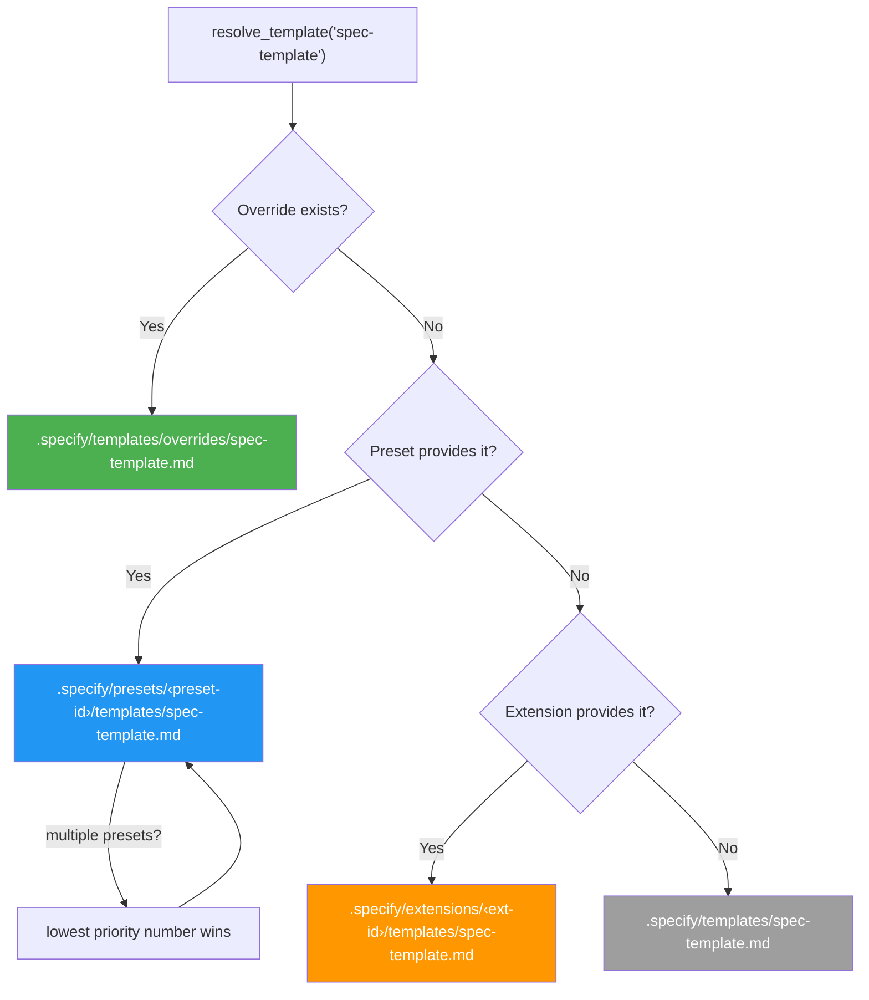
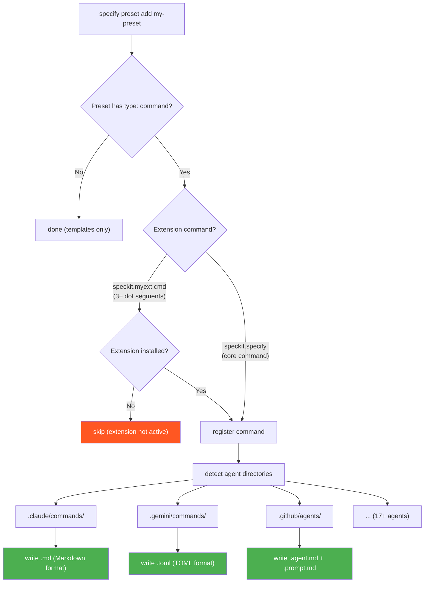
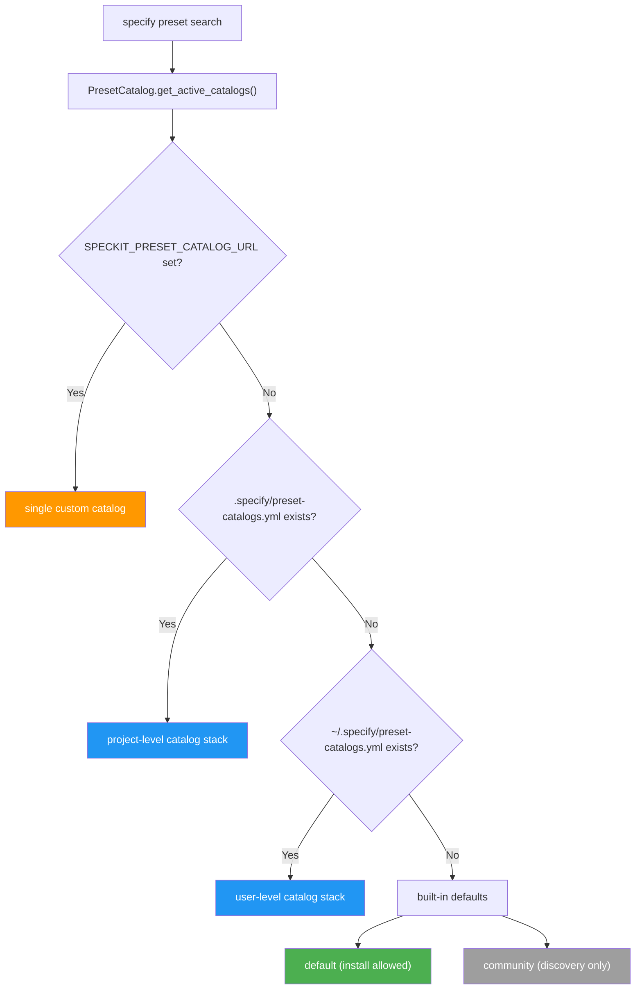

# Preset System Architecture

This document describes the internal architecture of the preset system — how template resolution, command registration, and catalog management work under the hood.

For usage instructions, see [README.md](README.md).

## Template Resolution

When Spec Kit needs a template (e.g. `spec-template`), the `PresetResolver` walks a priority stack and returns the first match:



| Priority | Source | Path | Use case |
|----------|--------|------|----------|
| 1 (highest) | Override | `.specify/templates/overrides/` | One-off project-local tweaks |
| 2 | Preset | `.specify/presets/<id>/templates/` | Shareable, stackable customizations |
| 3 | Extension | `.specify/extensions/<id>/templates/` | Extension-provided templates |
| 4 (lowest) | Core | `.specify/templates/` | Shipped defaults |

When multiple presets are installed, they're sorted by their `priority` field (lower number = higher precedence). This is set via `--priority` on `specify preset add`.

The resolution is implemented three times to ensure consistency:
- **Python**: `PresetResolver` in `src/specify_cli/presets.py`
- **Bash**: `resolve_template()` in `scripts/bash/common.sh`
- **PowerShell**: `Resolve-Template` in `scripts/powershell/common.ps1`

### Composition Strategies

Templates, commands, and scripts support a `strategy` field that controls how a preset's content is combined with lower-priority content instead of fully replacing it:

| Strategy | Description | Templates | Commands | Scripts |
|----------|-------------|-----------|----------|---------|
| `replace` (default) | Fully replaces lower-priority content | ✓ | ✓ | ✓ |
| `prepend` | Places content before lower-priority content (separated by a blank line) | ✓ | ✓ | — |
| `append` | Places content after lower-priority content (separated by a blank line) | ✓ | ✓ | — |
| `wrap` | Content contains `{CORE_TEMPLATE}` (templates/commands) or `$CORE_SCRIPT` (scripts) placeholder replaced with lower-priority content | ✓ | ✓ | ✓ |

Composition is recursive — multiple composing presets chain. The `PresetResolver.resolve_content()` method walks the full priority stack bottom-up and applies each layer's strategy.

Content resolution functions for composition:
- **Python**: `PresetResolver.resolve_content()` in `src/specify_cli/presets.py` (templates, commands, and scripts)
- **Bash**: `resolve_template_content()` in `scripts/bash/common.sh` (templates only; command/script composition is handled by the Python resolver)
- **PowerShell**: `Resolve-TemplateContent` in `scripts/powershell/common.ps1` (templates only; command/script composition is handled by the Python resolver)

## Command Registration

When a preset is installed with `type: "command"` entries, the `PresetManager` registers them into all detected agent directories using the shared `CommandRegistrar` from `src/specify_cli/agents.py`.



### Extension safety check

Command names follow the pattern `speckit.<ext-id>.<cmd-name>`. When a command has 3+ dot segments, the system extracts the extension ID and checks if `.specify/extensions/<ext-id>/` exists. If the extension isn't installed, the command is skipped — preventing orphan files referencing non-existent extensions.

Core commands (e.g. `speckit.specify`, with only 2 segments) are always registered.

### Agent format rendering

The `CommandRegistrar` renders commands differently per agent:

| Agent | Format | Extension | Arg placeholder |
|-------|--------|-----------|-----------------|
| Claude, Kilo Code, opencode, etc. | Markdown | `.md` | `$ARGUMENTS` |
| Copilot | Markdown | `.agent.md` + `.prompt.md` | `$ARGUMENTS` |
| Gemini, Qwen, Tabnine | TOML | `.toml` | `{{args}}` |

### Cleanup on removal

When `specify preset remove` is called, the registered commands are read from the registry metadata and the corresponding files are deleted from each agent directory, including Copilot companion `.prompt.md` files.

## Catalog System



Catalogs are fetched with a 1-hour cache (per-URL, SHA256-hashed cache files). Each catalog entry has a `priority` (for merge ordering) and `install_allowed` flag.

## Repository Layout

```
presets/
├── ARCHITECTURE.md                         # This file
├── PUBLISHING.md                           # Guide for submitting presets to the catalog
├── README.md                               # User guide
├── catalog.json                            # Official preset catalog
├── catalog.community.json                  # Community preset catalog
├── scaffold/                               # Scaffold for creating new presets
│   ├── preset.yml                          # Example manifest
│   ├── README.md                           # Guide for customizing the scaffold
│   ├── commands/
│   │   ├── speckit.specify.md              # Core command override example
│   │   └── speckit.myext.myextcmd.md       # Extension command override example
│   └── templates/
│       ├── spec-template.md                # Core template override example
│       └── myext-template.md               # Extension template override example
└── self-test/                              # Self-test preset (overrides all core templates)
    ├── preset.yml
    ├── commands/
    │   └── speckit.specify.md
    └── templates/
        ├── spec-template.md
        ├── plan-template.md
        ├── tasks-template.md
        ├── checklist-template.md
        └── constitution-template.md
```

## Module Structure

```
src/specify_cli/
├── agents.py       # CommandRegistrar — shared infrastructure for writing
│                    #   command files to agent directories
├── presets.py       # PresetManifest, PresetRegistry, PresetManager,
│                    #   PresetCatalog, PresetCatalogEntry, PresetResolver
└── __init__.py      # CLI commands: specify preset list/add/remove/search/
                     #   resolve/info, specify preset catalog list/add/remove
```
